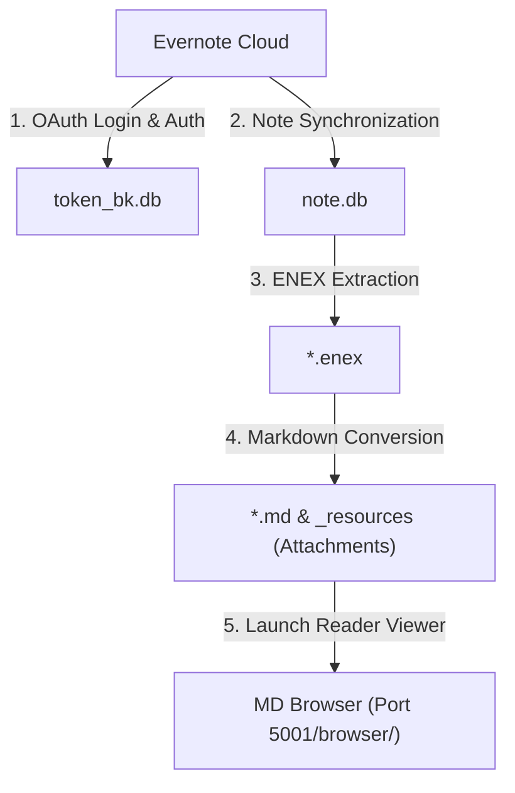

# Evernote BackupManager (EvBackup)

🌐 **[English](README.md) | [한국어](README.ko.md) | [日本語](README.ja.md) | [简体中文](README.zh.md) | [Español](README.es.md) | [Deutsch](README.de.md)**

A premium Web-UI based backup management dashboard designed to synchronize Evernote notes into a local SQLite database and convert them into beautiful local Markdown archives with all original media attachments preserved.

---

## 🏗️ System Architecture



---

## ⚡ Quick Start

Follow these steps to clone the repository, install Python dependencies, and boot the web dashboard. For Windows users, you can simply run the `run_manager.bat` batch script.

```bash
# 1. Clone the repository and navigate to the project directory
git clone https://github.com/wangsung/EvBackup.git
cd EvBackup

# 2. Install required Python packages
pip install -r requirements.txt

# 3. Start the dashboard server (Navigate to http://127.0.0.1:5001 in your browser)
# Windows: Double-click run_manager.bat or run the following command
# Others: Run the following command
python manager_server.py
```

---

## 🛠️ Step-by-Step Guide

Once connected to the dashboard web interface, perform the backup process in the following order:

1. **Path Configuration**: Click `📂 Change Path` at the top of the screen to select your local backup storage directory (Default is `c:/{user}/ever_md`).
2. **Language Selection**: Toggle between `🌐 KO/EN/JA/ZH/ES/DE` on the top right header to instantly translate the entire dashboard interface.
3. **Evernote Authentication**: Click `🔑 Start Evernote Login`. Follow instructions in the newly opened terminal (CMD) console and web browser to authorize access (creates `token_bk.db` upon success).
4. **Run Full Backup**: Click `🚀 One-Click Full Backup` to execute note synchronization, ENEX files extraction, and Markdown compilation sequentially.
5. **View Local Output**: Click `📁 Open Local Backup` to open your system file explorer at the compiled Markdown archive directory.

---

## ✨ Features

* **Visual Web Dashboard**: Elegant, state-of-the-art status cards and active environments diagnostic systems powered by Flask with real-time piped terminal console log streaming.
* **Incremental Synchronization**: Performs full synchronization initially, then retrieves only newly created or modified notes during subsequent runs.
* **Dynamic Path Management**: Change backup targets instantly via native Windows Tkinter directory pickers.
* **Native 6-Language Localization**: Full dynamic localization system (English, Korean, Japanese, Chinese, Spanish, German) covering dashboards, modal guides, toasts, and native folder picker titles.
* **Flawless Markdown & Attachment Parser**:
  * Translates Evernote XML nodes into clean standard CommonMark with front matter attributes.
  * Extracts all media files (Images, PDFs, documents, audios) into a unified `_resources/` directory and binds them using relative links in notes.
  * Sanitizes invalid characters and quotes in notebook names to prevent file system errors.
* **Built-in Reader & Duplicate Cleaner**: Integrates the Markdown viewer `MD Browser` and the `Duplicate Note Cleaner` under a single port (Port 5001 `/browser/`) for immediate navigation.

---

## 📁 Directory Structure

```text
EvBackup/
├── backup.py             # Backup synchronization and Markdown conversion parser engine
├── manager_server.py     # Main Web-UI Dashboard server and REST APIs
├── requirements.txt      # Python dependencies checklist
├── run_manager.bat       # Windows launching script
├── i18n/                 # Localization dictionaries (ko, en, ja, zh, es, de)
├── mdbrowser/            # Integrated MDBrowser package
│   ├── routes.py         # Blueprint routing declarations
│   ├── static/
│   │   └── style.css     # MDBrowser custom stylesheets
│   └── templates/
│       ├── browser.html  # Navigation reader reader HTML template
│       └── cleaner.html  # Duplicate Note Cleaner interface HTML template
├── templates/
│   └── index.html        # Dashboard HTML template
├── static/
│   └── style.css         # Dashboard CSS style sheet
└── docs/                 # Systems designs and technical walkthrough logs
```

---

## 🤝 License

This project is licensed under the terms of the **MIT License**.
