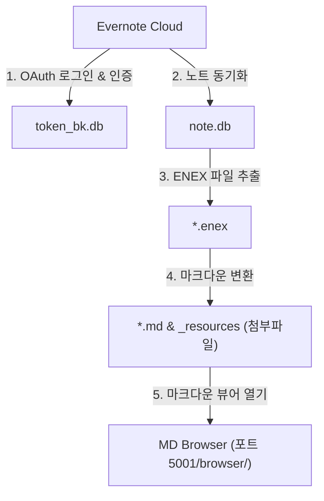

# Evernote BackupManager (EvBackup)

에버노트(Evernote) 노트를 로컬 SQLite 데이터베이스로 동기화하고, 첨부파일을 포함한 로컬 마크다운(Markdown) 문서로 변환하는 웹 UI 기반 백업 관리 도구입니다.

---

## 🏗️ 시스템 구조도



---

## ⚡ 빠른 시작 (Quick Start)

로컬 환경에서 이 프로그램을 복제하고 실행하는 방법입니다. 의존성 라이브러리 설치 후, 윈도우 사용자는 `run_manager.bat` 파일을 실행하여 대시보드를 구동할 수 있습니다.

```bash
# 1. 저장소 복제 및 폴더 이동
git clone https://github.com/wangsung/EvBackup.git
cd EvBackup

# 2. 필수 라이브러리 의존성 설치
pip install -r requirements.txt

# 3. 프로그램 실행 (브라우저에서 http://127.0.0.1:5001 접속)
# Windows: run_manager.bat 실행 또는 아래 명령 실행
# 기타 OS: 아래 명령 실행
python manager_server.py
```

---

## 🛠️ 백업 및 변환 순서 (웹 UI 대시보드 조작)

대시보드 접속 후 아래 순서로 백업을 진행합니다.

1. **경로 설정**: 화면 상단 `📂 경로 변경` 버튼으로 로컬 백업 폴더를 선택합니다 (기본값: `c:/{user}/ever_md`).
2. **에버노트 로그인**: `🔑 로그인 인증 받기`를 누르면 팝업되는 콘솔 창과 브라우저를 통해 로그인을 완료합니다 (완료 시 `token_bk.db` 생성).
3. **전체 백업 실행**: `🚀 원클릭 전체백업`을 실행하여 동기화, ENEX 추출, 마크다운 변환을 순차적으로 진행합니다.
4. **산출물 확인**: `📁 로컬 백업 폴더` 버튼을 누르면 변환된 마크다운 폴더가 열립니다.

---

## ✨ 핵심 기능

* **웹 UI 대시보드**: Flask 기반의 상태 진단 카드 구조 및 실시간 콘솔 로그 스트리밍 뷰어를 제공합니다.
* **증분 동기화**: 최초 전체 동기화 이후에는 에버노트 클라우드의 변경 및 추가된 노트만 데이터베이스에 동기화합니다.
* **경로 관리**: 윈도우 네이티브 폴더 선택기 창을 통해 저장소 경로를 동적으로 변경하고 `config.json`에 반영합니다.
* **마크다운 및 첨부파일 변환**:
  * 에버노트 XML 포맷 본문을 Markdown 표준 규격 및 Front Matter로 변환합니다.
  * 첨부파일(이미지, PDF, 문서 등)을 `_resources` 폴더로 분리 저장하고, 본문 내 링크를 상대 경로로 자동 전환합니다.
  * 노트북 명칭 내 특수문자나 따옴표 등 파일 시스템 오류 유발 요소를 정제하여 변환합니다.
* **통합 뷰어 내장**: 마크다운 뷰어인 `MD Browser`가 대시보드 서버 내에 내장되어 단일 포트(5001번 포트의 `/browser/`)에서 원클릭으로 기동 및 연동됩니다.

---

## 📁 디렉토리 구조

```text
EvBackup/
├── backup.py             # 에버노트 백업, 동기화, ENEX 추출 및 마크다운 변환 모듈
├── manager_server.py     # 대시보드 API 및 Flask 웹 서버 실행 파일
├── requirements.txt      # 의존성 패키지 목록
├── run_manager.bat       # 대시보드 실행 배치 스크립트
├── templates/
│   └── index.html        # 대시보드 HTML 템플릿
├── static/
│   └── style.css         # 대시보드 CSS 스타일 시트
└── docs/                 # 설계 및 변경 이력 개발 문서
    ├── implementation_plan.md
    ├── task.md
    └── walkthrough.md
```

---

## 🤝 라이선스

이 프로젝트는 **MIT License**를 따릅니다.
