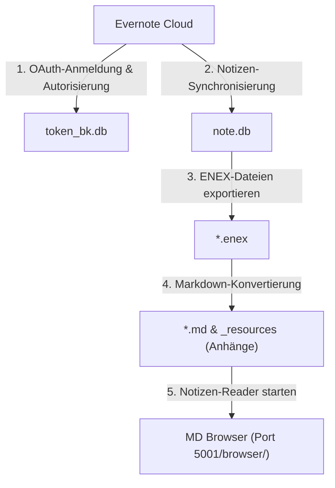

# Evernote BackupManager (EvBackup)

🌐 **[English](../README.md) | [한국어](README.ko.md) | [日本語](README.ja.md) | [简体中文](README.zh.md) | [Español](README.es.md) | [Deutsch](README.de.md)**

Ein Premium-Web-UI-basiertes Backup-Verwaltungstool zur Synchronisierung von Evernote-Notizen in eine lokale SQLite-Datenbank und Konvertierung in ansprechende lokale Markdown-Dokumente inklusive aller Original-Medienanhänge.

---

## ⚡ Schnellstart (Quick Start)

Befolgen Sie diese Schritte, um das Repository zu klonen, Python-Abhängigkeiten zu installieren und das Dashboard zu starten. Windows-Benutzer können einfach das Batch-Skript `run_manager.bat` ausführen.

```bash
# 1. Klonen Sie das Repository und wechseln Sie in das Projektverzeichnis
git clone https://github.com/wangsung/EvBackup.git
cd EvBackup

# 2. Installieren Sie die erforderlichen Python-Pakete
pip install -r requirements.txt

# 3. Starten Sie den Dashboard-Server (Öffnen Sie http://127.0.0.1:5001 im Browser)
# Windows: Doppelklicken Sie auf run_manager.bat oder führen Sie den folgenden Befehl aus
# Andere Betriebssysteme: Führen Sie den folgenden Befehl aus
python manager_server.py
```

---

## 🛠️ Schritt-für-Schritt-Backup-Anleitung

Führen Sie nach dem Herstellen der Verbindung zum Dashboard den Backup-Vorgang in der folgenden Reihenfolge aus:

1. **Pfad konfigurieren**: Klicken Sie oben auf dem Bildschirm auf `📂 Pfad ändern`, um Ihr lokales Backup-Verzeichnis auszuwählen (Standard ist `c:/{user}/ever_md`).
2. **Sprachauswahl**: Wählen Sie in der Kopfzeile oben rechts die gewünschte Sprache aus (🌐 KO/EN/JA/ZH/ES/DE), um die gesamte Dashboard-Oberfläche sofort zu übersetzen.
3. **Evernote-Autorisierung**: Klicken Sie auf `🔑 Bei Evernote anmelden`. Befolgen Sie die Anweisungen im neu geöffneten CMD-Terminalfenster und im Webbrowser (erstellt nach Erfolg `token_bk.db`).
4. **Backup ausführen**: Klicken Sie auf `🚀 Ein-Klick-Komplettbackup`, um Notizen-Synchronisierung, ENEX-Extraktion und Markdown-Kompilierung nacheinander auszuführen.
5. **Ergebnisse anzeigen**: Klicken Sie auf `📁 Backup-Ordner öffnen`, um das konvertierte lokale Verzeichnis im Windows-Explorer zu öffnen.

---

## 🏗️ Systemarchitektur



---

## ✨ Hauptfunktionen

* **Visuelles Web-Dashboard**: Modernes, elegantes Statuskartensystem auf Flask-Basis mit Echtzeit-Streaming-Ansicht der CMD-Konsolenprotokolle.
* **Inkrementelle Synchronisierung**: Führt beim ersten Durchlauf eine vollständige Synchronisierung durch und lädt bei nachfolgenden Durchläufen nur neue oder geänderte Notizen herunter.
* **Dynamische Pfadverwaltung**: Ändern Sie Speicherziele direkt über das systemeigene Windows-Ordnerauswahlfenster (Tkinter).
* **Native 6-Sprachen-Lokalisierung**: Volle dynamische Lokalisierung (Deutsch, Englisch, Koreanisch, Japanisch, Chinesisch, Spanisch) für alle Dashboard-Inhalte, Anmeldeinformationen und systemeigenen Ordnerauswahltitel.
* **Makelloser Markdown- & Ressourcen-Parser**:
  * Übersetzt Evernote-XML-Daten in sauberes CommonMark-Markdown mit integrierten Front-Matter-Metadaten.
  * Extrahiert alle Anhänge (Bilder, PDFs, Dokumente, Audios) in ein lokales Verzeichnis namens `_resources/` und passt interne Links auf relative Pfade an.
  * Bereinigt ungültige Sonderzeichen und Anführungszeichen in Notizbuchnamen, um Dateisystemfehler zu vermeiden.
* **Integrierter Reader & Duplikate-Bereiniger**: Der Notizen-Viewer `MD Browser` und der Duplikate-Bereiniger `Duplicate Note Cleaner` sind vollständig in den Dashboard-Server integriert (unter Port 5001 `/browser/`) für eine nahtlose One-Port-Bedienung.

---

## 📁 Verzeichnisstruktur

```text
EvBackup/
├── backup.py             # Backup-Synchronisierung und Markdown-Konvertierungsskript
├── manager_server.py     # Flask-Webserver und REST-API-Routing
├── requirements.txt      # Python-Abhängigkeitsliste
├── run_manager.bat       # Windows-Start-Batch-Skript
├── i18n/                 # Lokalisierungswörterbücher (ko, en, ja, zh, es, de)
├── mdbrowser/            # Integriertes MDBrowser-Paket
│   ├── routes.py         # Blueprint-Routing-Deklarationen
│   ├── static/
│   │   └── style.css     # CSS-Dateien des MDBrowsers
│   └── templates/
│       ├── browser.html  # Notizen-Reader-HTML-Vorlage
│       └── cleaner.html  # Duplikate-Bereiniger-HTML-Vorlage
├── templates/
│   └── index.html        # Dashboard-HTML-Vorlage
├── static/
│   └── style.css         # Dashboard-CSS-Vorlage
└── docs/                 # Technische Walkthrough- und Entwurfsdokumentation
```

---

## 🤝 Lizenz

Dieses Projekt ist unter den Bedingungen der **MIT License** lizenziert.
