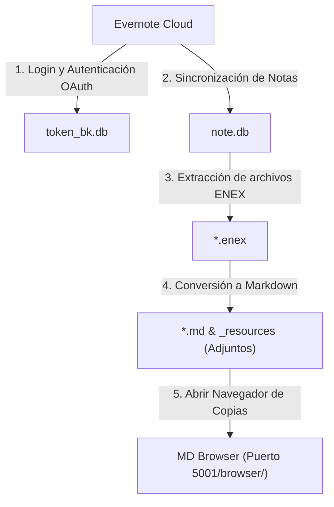

# Evernote BackupManager (EvBackup)

🌐 **[English](../README.md) | [한국어](README.ko.md) | [日本語](README.ja.md) | [简体中文](README.zh.md) | [Español](README.es.md) | [Deutsch](README.de.md)**

Una plataforma web premium para la gestión y control de copias de seguridad de Evernote. Sincroniza sus notas en una base de datos SQLite local y las convierte en hermosos documentos Markdown preservando todos los archivos multimedia adjuntos.

---

## ⚡ Inicio Rápido (Quick Start)

Pasos para clonar el repositorio, instalar las dependencias necesarias y arrancar el servidor web local. Los usuarios de Windows pueden simplemente ejecutar el script `run_manager.bat`.

```bash
# 1. Clonar el repositorio y acceder a la carpeta del proyecto
git clone https://github.com/wangsung/EvBackup.git
cd EvBackup

# 2. Instalar las dependencias de Python requeridas
pip install -r requirements.txt

# 3. Iniciar el servidor web (Acceda a http://127.0.0.1:5001 en su navegador)
# En Windows: Ejecutar run_manager.bat o el siguiente comando en consola
# Otros sistemas operativos: Ejecutar el siguiente comando
python manager_server.py
```

---

## 🛠️ Guía del Proceso de Copia de Seguridad

Una vez conectado al panel de control de la aplicación, realice el proceso de respaldo en el siguiente orden:

1. **Configuración de la Ruta**: Haga clic en `📂 Cambiar Ruta` en la parte superior para seleccionar su carpeta de destino local (La ruta predeterminada es `c:/{user}/ever_md`).
2. **Selección de Idioma**: Utilice el selector de la esquina superior derecha (🌐 KO/EN/JA/ZH/ES/DE) para cambiar dinámicamente todo el idioma de la aplicación.
3. **Autenticación en Evernote**: Haga clic en `🔑 Iniciar Sesión en Evernote`. Siga las instrucciones del terminal negro (CMD) y del navegador web para validar el acceso (se creará el archivo `token_bk.db` al finalizar).
4. **Respaldar Todo**: Haga clic en `🚀 Copia de Seguridad Completa en Un Clic` para realizar en secuencia la sincronización, extracción de ENEX y compilación a Markdown.
5. **Ver Resultados**: Haga clic en `📁 Abrir Carpeta de Copias` para explorar sus notas Markdown locales recién creadas.

---

## 🏗️ Esquema del Sistema



---

## ✨ Características Principales

* **Panel de Control Visual**: Elegante interfaz web impulsada por Flask con tarjetas de diagnóstico en tiempo real y visualizador de registros del terminal (console logs) por streaming interactivo.
* **Sincronización Incremental**: Descarga todas las notas en el primer uso. En ejecuciones posteriores, solo descarga las notas nuevas o aquellas que hayan sido modificadas en la nube.
* **Cambio de Ruta Dinámico**: Modifique el directorio de copias en tiempo real mediante un selector de carpetas nativo de Windows (Tkinter).
* **Internacionalización en 6 Idiomas**: Soporte nativo y dinámico de español, inglés, coreano, japonés, chino y alemán, incluyendo el título de la ventana nativa de selección de carpetas.
* **Conversor de Markdown y Archivos Adjuntos Impecable**:
  * Traduce la estructura XML de Evernote a CommonMark estándar con metadatos Front Matter incluidos.
  * Extrae todos los recursos (imágenes, PDFs, audios, documentos) a una carpeta local llamada `_resources` y adapta los enlaces dentro de las notas utilizando rutas relativas.
  * Sanea y limpia los nombres de libretas para evitar colisiones de caracteres no válidos con el sistema de archivos del sistema operativo.
* **Navegador y Limpiador Integrados**: Integra el visor de Markdown `MD Browser` y el limpiador de notas duplicadas (`Duplicate Note Cleaner`) bajo el mismo puerto web (Puerto 5001 `/browser/`) para una operación unificada.

---

## 📁 Estructura del Directorio

```text
EvBackup/
├── backup.py             # Script de sincronización, extracción ENEX y analizador Markdown
├── manager_server.py     # Servidor Flask principal y control de APIs del panel
├── requirements.txt      # Listado de dependencias del sistema
├── run_manager.bat       # Script ejecutable para Windows
├── i18n/                 # Diccionarios de idioma locales (ko, en, ja, zh, es, de)
├── mdbrowser/            # Paquete integrado del Navegador de Copias (MDBrowser)
│   ├── routes.py         # Declaración de rutas Blueprint de Flask
│   ├── static/
│   │   └── style.css     # Hoja de estilos CSS del Navegador
│   └── templates/
│       ├── browser.html  # Interfaz del lector de notas Markdown
│       └── cleaner.html  # Interfaz del limpiador de duplicados
├── templates/
│   └── index.html        # Plantilla HTML del panel de control
├── static/
│   └── style.css         # Hoja de estilos del panel de control
└── docs/                 # Documentos de diseño técnico e históricos de cambios
```

---

## 🤝 Licencia

Este proyecto está bajo los términos de la licencia **MIT License**.
