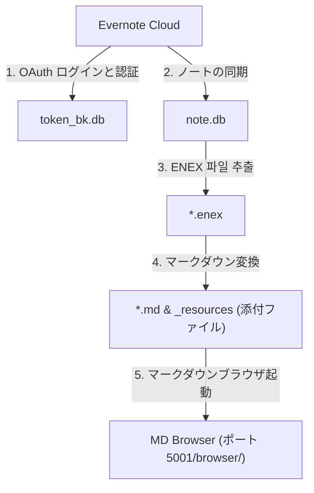

# Evernote BackupManager (EvBackup)

🌐 **[English](../README.md) | [한국어](README.ko.md) | [日本語](README.ja.md) | [简体中文](README.zh.md) | [Español](README.es.md) | [Deutsch](README.de.md)**

Evernote（エバーノート）のノートをローカルのSQLiteデータベースに同期し、添付ファイルを含むローカルのマークダウン（Markdown）形式に変換する、ウェブUIベースのバックアップ管理ツールです。

---

## ⚡ クイックスタート (Quick Start)

ローカル環境でこのプログラムを複製して実行する方法です。依存関係のあるライブラリをインストールした後、Windowsユーザーは `run_manager.bat` ファイルを実行してダッシュボードを起動できます。

```bash
# 1. リポジトリのクローンとフォルダ移動
git clone https://github.com/wangsung/EvBackup.git
cd EvBackup

# 2. 必要なライブラリ依存関係のインストール
pip install -r requirements.txt

# 3. プログラムの実行 (ブラウザから http://127.0.0.1:5001 にアクセス)
# Windows: run_manager.bat の実行、または以下のコマンドを実行
# その他のOS: 以下のコマンドを実行
python manager_server.py
```

---

## 🛠️ バックアップと変換の手順 (Web-UIダッシュボード操作)

ダッシュボードに接続後、以下の手順でバックアップを行います。

1. **パスの設定**: 画面上部の `📂 パス変更` ボタンからローカルのバックアップ保存先フォルダを選択します（デフォルト: `c:/{user}/ever_md`）。
2. **言語の選択**: 右上の言語切替トグル（🌐 KO/EN/JA/ZH/ES/DE）を押して、ダッシュボード画面全体を任意の言語に切り替えます。
3. **Evernote ログイン**: `🔑 ログイン認証を開始` を押すと起動するコマンドライン（CMD）画面とブラウザを通じてログイン認証を完了します（完了時に `token_bk.db` が生成されます）。
4. **一括バックアップ実行**: `🚀 ワンクリック一括バックアップ` を実行して、同期、ENEX抽出、マークダウン変換を順番に処理します。
5. **成果物の確認**: `📁 로컬 백업 폴더` ボタンを押すと、変換されたマークダウンフォルダが開きます。

---

## 🏗️ システム構成図



---

## ✨ 主な機能

* **Web-UIダッシュボード**: Flaskベースの環境診断カード構造と、リアルタイムのコンソールログストリーミングビューアを提供します。
* **差分同期**: 初回同期完了後は、Evernoteクラウド上で変更または追加されたノートのみをデータベースに同期します。
* **保存先管理**: Windows標準のフォルダ選択ダイアログを通じてバックアップ先パスを動的に変更し、`config.json`に即時反映します。
* **6か国語多国語対応**: 日本語、韓国어、英語、中国語、スペイン語、ドイツ語をネイティブサポートし、フォルダ選択画面 of フォルダ選択画面のタイトルなども選択した言語に動的ローカライズされます。
* **高品質なマークダウン変換**:
  * Evernoteの独自のXML形式の本文を、標準CommonMark規格およびFront Matterメタデータに正確に変換します。
  * 添付ファイル（画像、PDF、ドキュメントなど）を `_resources` フォルダに分類保存し、本文内のリンクを相対パスに自動変更します。
  * ノートブック名に含まれる特殊文字や引用符など、ファイルシステムのエラー原因となる文字を安全にクレンジングします。
* **統合ブラウザ内蔵**: マークダウンビューア `MD Browser` と重複整理モジュール `Duplicate Note Cleaner` がダッシュボード内に完全に統合され、単一ポート（ポート5001の `/browser/`）からワンクリックで呼び出し可能です。

---

## 📁 ディレクトリ構造

```text
EvBackup/
├── backup.py             # バックアップ、同期、ENEX抽出、マークダウン変換を担うエンジン
├── manager_server.py     # メインWeb-UIダッシュボードおよびFlask Webサーバー
├── requirements.txt      # 依存パッケージリスト
├── run_manager.bat       # Windows用起動バッチスクリプト
├── i18n/                 # 各言語（ko, en, ja, zh, es, de）辞書フォルダ
├── mdbrowser/            # 統合型MDBrowserパッケージ
│   ├── routes.py         # Blueprintルーティング
│   ├── static/
│   │   └── style.css     # MDBrowser用CSSスタイルシート
│   └── templates/
│       ├── browser.html  # アーカイブ閲覧HTMLテンプレート
│       └── cleaner.html  # 重複ファイル整理HTMLテンプレート
├── templates/
│   └── index.html        # ダッシュボードHTMLテンプレート
├── static/
│   └── style.css         # ダッシュボードCSSスタイルシート
└── docs/                 # 設計、技術ログドキュメント
```

---

## 🤝 ライセンス

このプロジェクトは **MIT License** に従って提供されます。
