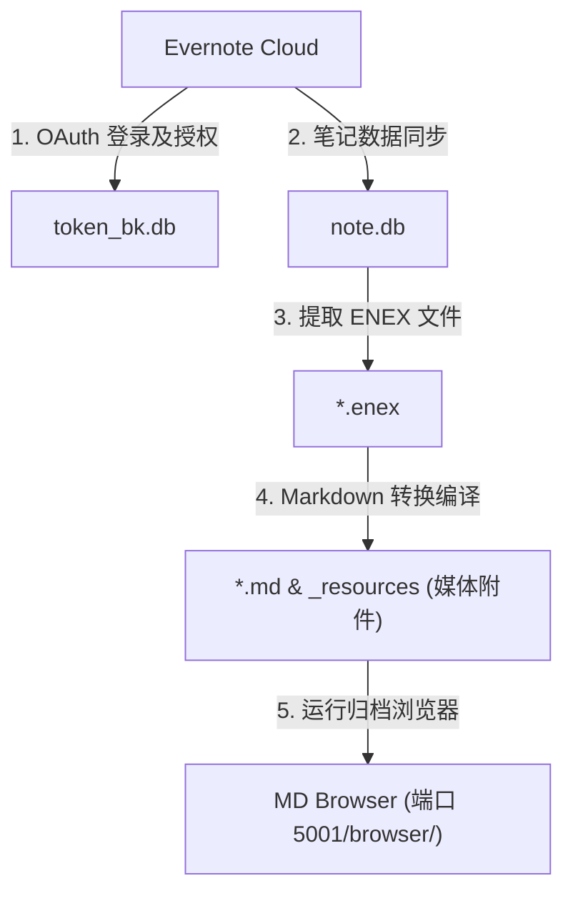

# Evernote BackupManager (EvBackup)

🌐 **[English](../README.md) | [한국어](README.ko.md) | [日本語](README.ja.md) | [简体中文](README.zh.md) | [Español](README.es.md) | [Deutsch](README.de.md)**

这是一款基于 Web 用户界面的 Evernote（印象笔记）本地备份管理面板。能够将您的云端笔记无缝同步至本地 SQLite 数据库，并将其转换为包含全部媒体附件的标准 Markdown（麦克唐纳）归档文档。

---

## 🏗️ 系统架构图



---

## ⚡ 快速开始 (Quick Start)

以下是克隆项目库、安装依赖并启动 Web 控制面板面板的步骤。Windows（窗口）用户可以直接运行 `run_manager.bat` 批处理脚本。

```bash
# 1. 克隆代码库并进入项目文件夹
git clone https://github.com/wangsung/EvBackup.git
cd EvBackup

# 2. 安装所需的 Python 依赖包
pip install -r requirements.txt

# 3. 启动大厅控制台服务器 (在浏览器中访问 http://127.0.0.1:5001)
# Windows 用户：直接双击 run_manager.bat 或运行下方命令
# 其他系统用户：运行下方命令
python manager_server.py
```

---

## 🛠️ 备份与转换步骤 (控制面板操作指南)

连接到控制面板后，请按照以下顺序完成备份：

1. **路径配置**: 点击页面上方的 `📂 更改路径` 按钮，选择本地备份的存储目标目录（默认值为 `c:/{user}/ever_md`）。
2. **语言切换**: 切换右上角标题栏的 `🌐 KO/EN/JA/ZH/ES/DE` 按钮，可即时将整个控制面板翻译为相应的语言。
3. **安全凭证授权**: 点击 `🔑 开始登录授权`。在随后弹出的 CMD 命令行黑色窗口和浏览器中完成 Evernote 登录及确认许可（成功后将自动生成本地安全令牌凭证 `token_bk.db`）。
4. **运行完整备份**: 点击 `🚀 一键完整备份` 按钮，程序将依次自动执行增量同步、提取 ENEX 文件和编译 Markdown 笔记。
5. **浏览本地产出**: 点击 `📁 浏览本地备份目录` 按钮，可以立刻在系统资源管理器中打开已转换编译的 Markdown 文件。

---

## ✨ 核心特性

* **可视化 Web 仪表盘**: 搭载优雅现代的 Flask 系统诊断卡片，并集成管道流式输出的实时的控制台控制面板日志查看器。
* **增量数据同步**: 首次运行进行全量数据同步，此后运行仅获取在 Evernote 云端新增或被编辑更改的笔记。
* **动态路径管理**: 通过 Windows 系统的原生 Tkinter 文件夹选择器即时动态重置备份目标。
* **原生 6 国语言本地化**: 完美支持中文、英语、韩语、日语、西班牙语、德语。包含控制面板、模态授权指南、提示通知及原生路径选择对话框的全面动态翻译。
* **无可挑剔的 Markdown 附件转换器**:
  * 将 Evernote 复杂的 XML 内容无缝编译为标准的 CommonMark（普通麦克唐纳标记）文档，并自动编写 Front Matter 属性。
  * 将笔记内含的图片、PDF、文档、音频等各类媒体附件完整提取到 `_resources/` 目录下，并自动将其在笔记正文内改写为相对关联路径。
  * 智能清洗笔记本名称中包含的非法字符及特殊符号，消除由于操作系统文件命名冲突产生的各类错误。
* **高度集成的阅读器与副本清理器**: 将 Markdown 归档浏览器 `MD Browser` 以及 `Duplicate Note Cleaner`（重复副本清理器）无缝合流至单一服务中，提供统一端口（端口 5001 的 `/browser/`）的一站式体验。

---

## 📁 目录结构

```text
EvBackup/
├── backup.py             # 增量笔记同步、ENEX 提取及 Markdown 编译解析引擎
├── manager_server.py     # 大厅主面板 API 和 Flask Web 服务器入口
├── requirements.txt      # Python 依赖清单
├── run_manager.bat       # Windows 运行脚本
├── i18n/                 # 本地化多语言字典目录 (ko, en, ja, zh, es, de)
├── mdbrowser/            # 整合式 MDBrowser 内部包
│   ├── routes.py         # Blueprint 蓝图路由声明
│   ├── static/
│   │   └── style.css     # 浏览器专用 CSS 样式表
│   └── templates/
│       ├── browser.html  # 归档阅读器 HTML 模板
│       └── cleaner.html  # 重复笔记副本整理器 HTML 模板
├── templates/
│   └── index.html        # 大厅主面板 HTML 模板
├── static/
│   └── style.css         # 大厅主面板 CSS 样式表
└── docs/                 # 系统设计规范与技术 Walkthrough 日志目录
```

---

## 🤝 许可证

本项目基于 **MIT License** 许可证进行分发与许可。
